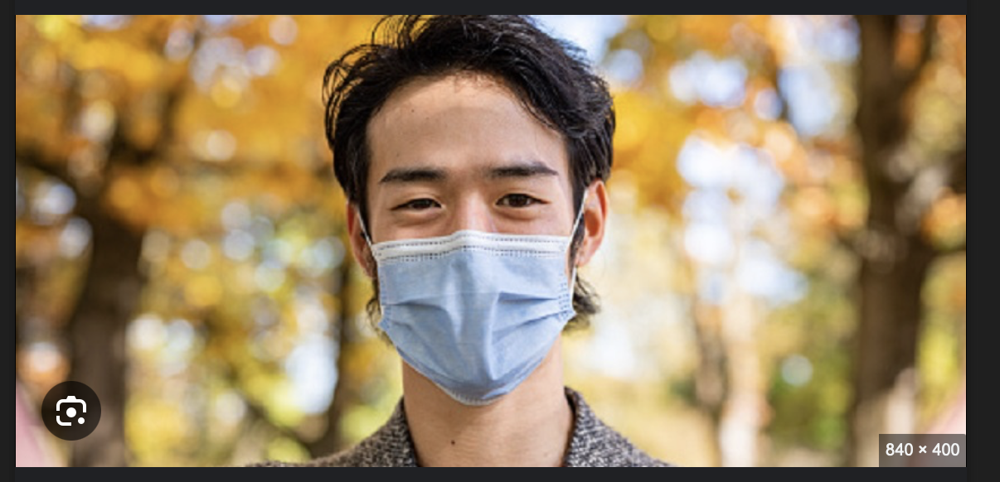
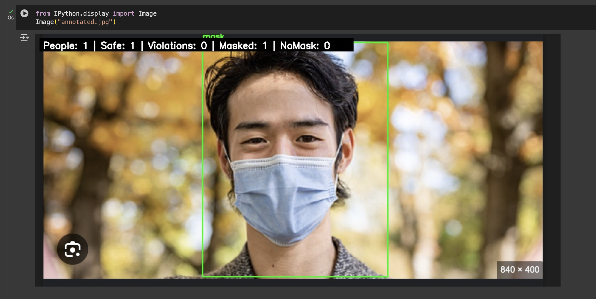
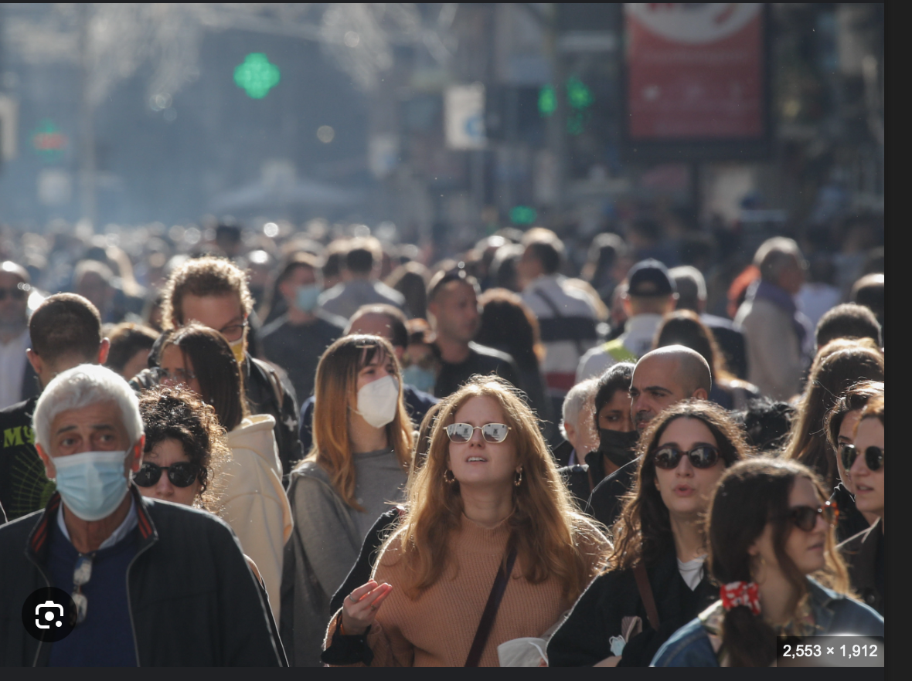
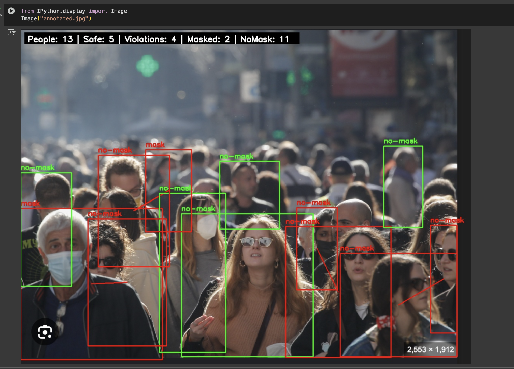
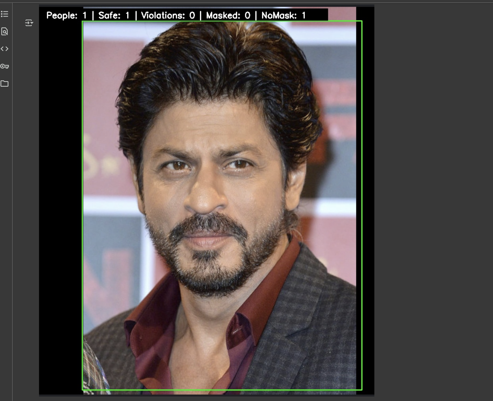
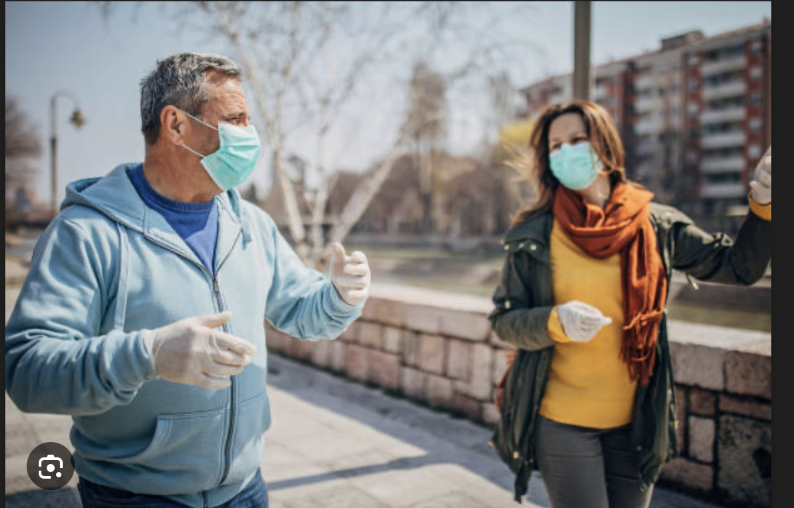
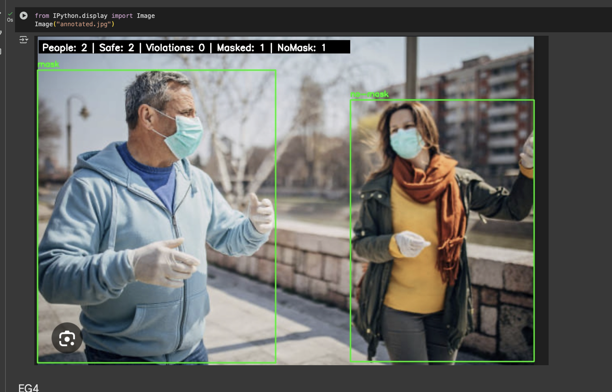
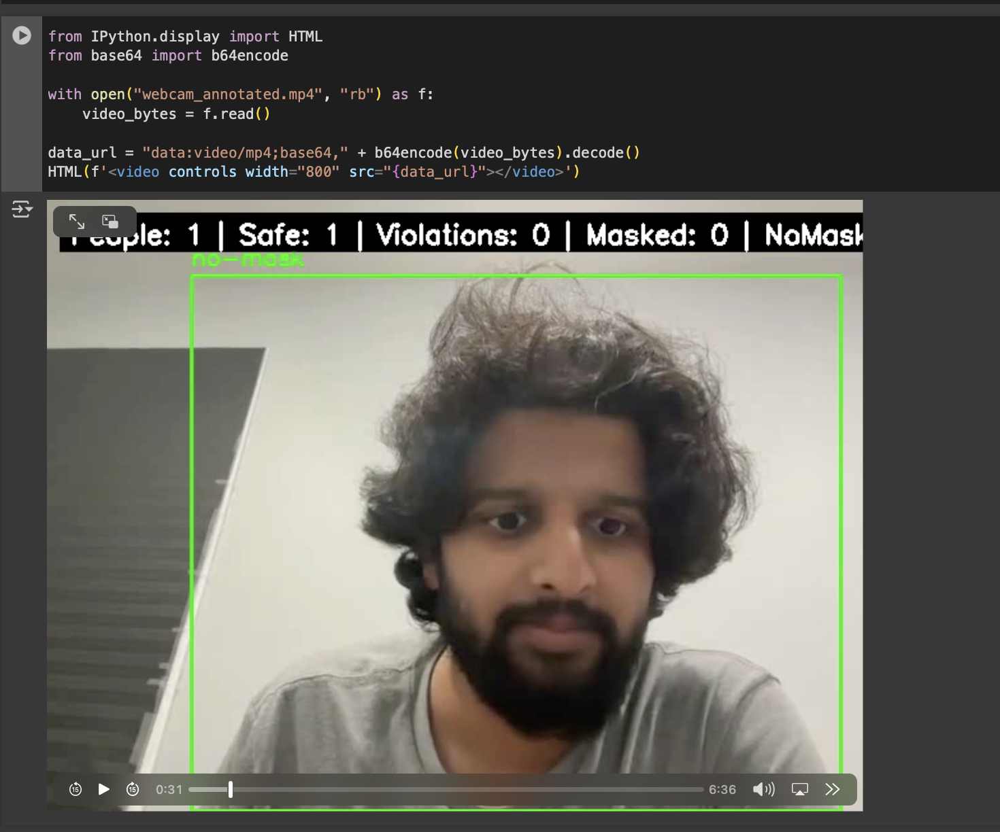

CoVID-19 Social Distancing & Face Mask Detector
A deep learning and computer vision project to monitor social distancing and face mask usage in real time. Built with Python, OpenCV, and YOLOv3, this tool helps enforce safety protocols by detecting individuals in video streams, checking if they are wearing masks, and calculating distances to flag social distancing violations.

🚀 Features
Person Detection using YOLOv3.
Social Distancing Monitoring
Bird’s-eye view transformation for accurate distance estimation.
Color-coded risk indicators:
🟥 Red: High risk
🟨 Yellow: Low risk
🟩 Green: Safe
Face Mask Detection (mask vs. no-mask).
Risk Summary Overlay: Shows total people, safe count, violations, masked, and unmasked.
Integration Ready with CCTV/security cameras.

🛠️ Tech Stack
Python 3
OpenCV / OpenCV-Contrib
NumPy, Time, Math
YOLOv3 (trained on COCO dataset)
TensorFlow (for detection graphs)

📊 Example Output
People: 1 | Safe: 1 | Violations: 0 | Masked: 0 | NoMask: 1
Annotated frames highlight individuals, risk zones, and mask compliance in real time.
#Eg1

#Eg2

#Eg3

#Eg4

#WebCam

📌 How It Works
Capture input from live webcam or video file.
Detect humans and extract center points.
Apply perspective transform for bird’s-eye view.
Compute pairwise distances between detected individuals.
Classify into Safe, Low Risk, or High Risk.
Detect face masks and label as Mask or No Mask.
Display annotated results in real time.

🔧 Setup & Run
Clone the repository:
git clone https://github.com/Kartikay77/Face-mask-and-social-distance-detector.git
cd Face-mask-and-social-distance-detector
Install dependencies:
pip install -r requirements.txt
Run the detector:
python covid19_social_distancing_and_face_mask-2.py
To use a webcam feed:
python covid19_social_distancing_and_face_mask-2.py --source 0
To test on a video file:
python covid19_social_distancing_and_face_mask-2.py --source path/to/video.mp4

📚 References
YOLOv3: Object Detection
Towards Data Science: AI for COVID-19
NCBI Study on Social Distancing
👨‍💻 Authors
Team Devmasters – VIT, Vellore
Kartikay Gupta
Abhishek Kumar
Ritik Rai
Tavish Sharma
Prathipati Sainikhil
Aman Kumar

